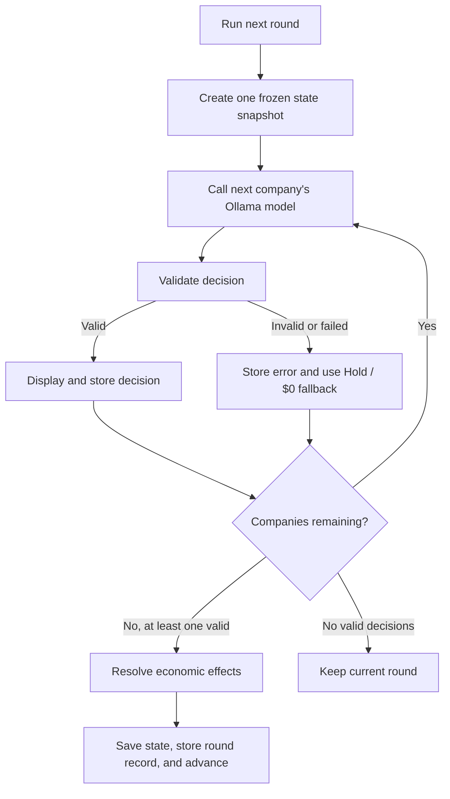
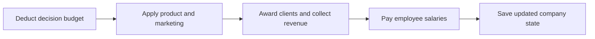
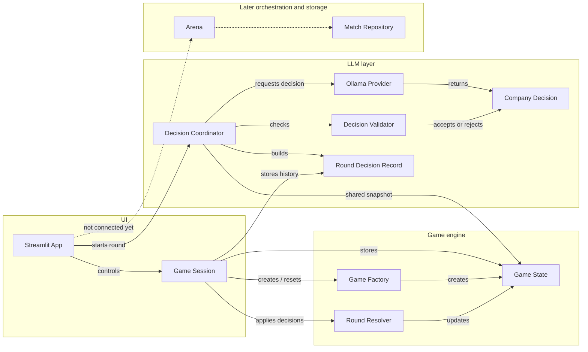
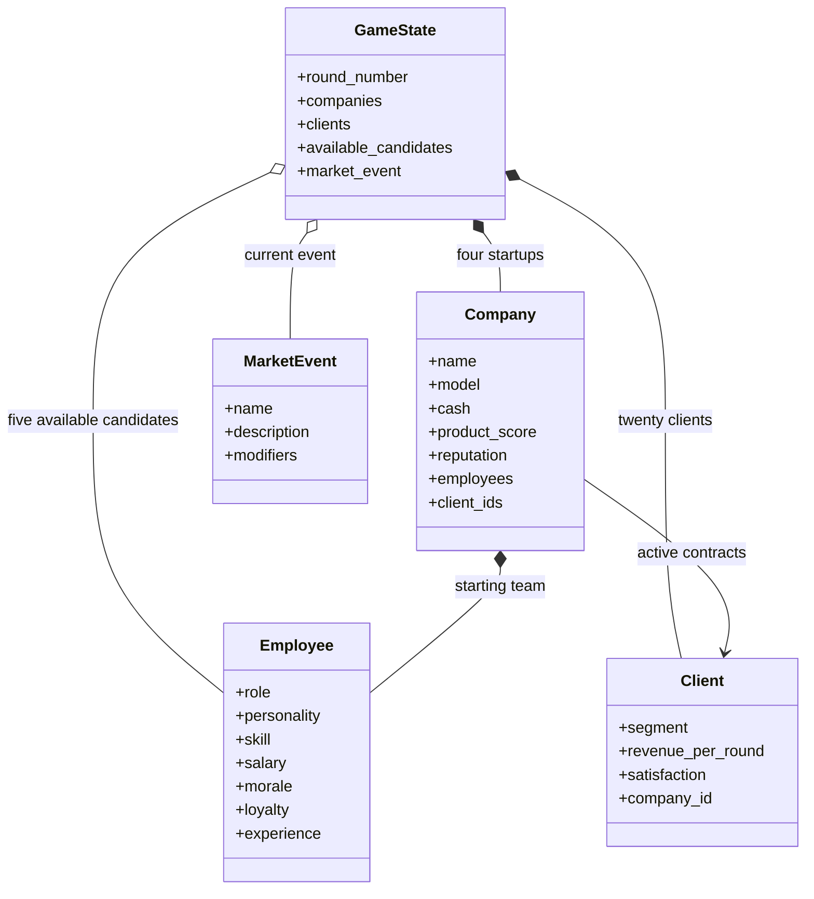

# LLM Startup Arena

Four local LLMs compete to build the most valuable startup over ten rounds.

The project is intentionally local-first and uses Ollama for model inference.

## Requirements

- [uv](https://docs.astral.sh/uv/)
- [Ollama](https://ollama.com/)
- The four local models:

```powershell
ollama pull qwen3:8b
ollama pull llama3.1:8b
ollama pull gemma3:12b
ollama pull mistral-nemo:12b
```

## Project structure

```text
llm_startup_arena/
|-- domain/         # Companies, employees, clients, events, and game state
|-- engine/         # Arena orchestration and deterministic round resolution
|-- llm/            # Provider contract, prompts, and Ollama integration
|-- persistence/    # JSON match storage
|-- ui/             # Streamlit interface
`-- config.py       # Global game configuration
```

The LLMs choose actions. The deterministic engine calculates all consequences.

## Employee roles

Employees are deterministic game entities, not additional LLM agents. Each employee has
a role, personality, skill level, salary, morale, loyalty, and experience. These values are
used by the game engine when it resolves company decisions.

| Role | Responsibility | Planned gameplay effect |
|---|---|---|
| `ENGINEER` | Builds and improves the technology | Makes product investment more effective |
| `PRODUCT` | Chooses what the company should build | Improves product direction and client satisfaction |
| `MARKETING` | Creates awareness and demand | Increases reputation and client attraction |
| `SALES` | Converts interested clients into contracts | Improves the chance of winning clients |
| `OPERATIONS` | Keeps the company efficient and organized | Reduces operating costs and supports employee morale |

The current starting team contains two engineers and one employee each in product,
marketing, and sales. Operations is available as a role but is not part of the initial
five-person team. Every role already contributes a deterministic company bonus.

### Employee personalities

All starting employees and external candidates have one formula-based personality. These
profiles are data, not additional LLM agents. Recruitment will use them to represent what
each employee values when evaluating an offer.

| Personality | Main preference |
|---|---|
| Ambitious | Product score and career growth |
| Visionary | Product investment and training |
| Creative | Reputation and marketing |
| Competitive | Salary and recruitment investment |
| Reliable | Stability and loyalty |

### External talent pool

Every new game starts with five available candidates: one engineer, product specialist,
marketer, salesperson, and operations specialist. The interface shows their role,
personality, skill, and salary.

Companies may target up to two candidates per round. Recruitment spending is divided equally
between those targets, and each offer needs at least `$20,000` per candidate. When several
companies target the same person, a deterministic score combines offer size, company
reputation, and that candidate's personality preference. The winner adds the candidate to its
team immediately, removes them from the available pool, and pays their salary that round.

Companies can also target up to two employees from competitors. Recruitment spending is shared
across all candidate and employee targets, with at least `$20,000` required per target. An offer
competes against the employee's loyalty, the current company's reputation, and its retention
spending. A successful offer transfers the employee immediately and updates both payrolls.

## Run locally

```powershell
uv sync
uv run streamlit run app.py
```

Open `http://localhost:8501` after Streamlit starts. `uv run` keeps the project
environment synchronized with `pyproject.toml` and `uv.lock`.

The main screen displays four company cards. `Run next round` calls the models one at a
time and displays each validated decision as soon as it arrives.

The `Company teams` section shows the current owner, role, personality, skill, morale,
loyalty, and salary of every employee. It updates after hiring, poaching, retention, payroll
penalties, and departures, making employee movement directly verifiable from the interface.

Run the checks with:

```powershell
uv run pytest
uv run ruff check .
```

## Round decision workflow

Each company receives the same frozen `GameState` snapshot. Models choose actions, while
the application validates and stores their responses without allowing them to calculate
or directly modify game outcomes.



Decision validation currently enforces:

- the total budget cannot exceed company cash;
- client and employee targets must exist and be unique;
- companies cannot recruit their own employees;
- sabotage requires a supported action, a competing company target, and at least `$20,000`;
- one invalid model response does not stop the other companies.

## Economic rules

The deterministic `RoundResolver` applies valid decisions in a fixed order. Models choose
the strategy and budget, but never calculate or directly apply the outcome.



### Investments

- the full decision budget is deducted from company cash once;
- every `$20,000` invested in `product` adds one `product_score` point;
- every `$20,000` invested in `marketing` adds one reputation point;
- product score and reputation are capped at `100`;
- sabotage effects are added in a later stage.

### Sabotage contract

The decision schema is ready for four sabotage actions: `product_disruption`,
`reputation_attack`, `client_interference`, and `talent_disruption`. A sabotage decision must
spend at least `$20,000`, select one of these actions, and identify an existing competing
company through `target_company_id`. A company cannot target itself.

The resolver does not apply sabotage effects yet. Until that stage is implemented, the model
prompt and decision normalizer keep sabotage disabled by setting its budget to `0` and both
the action and target to `null`.

### Training

- every `$25,000` assigned to training gives every current employee `+1 skill` and
  `+1 experience`;
- skill is capped at `100`, while experience has no upper limit;
- an incomplete `$25,000` training unit is still spent but produces no employee increase.

### Retention

- every `$20,000` assigned to retention gives every current employee `+2 morale` and
  `+2 loyalty`;
- morale and loyalty are capped at `100`;
- an incomplete `$20,000` retention unit is still spent but produces no increase.

### Employee role bonuses

Role power is the sum of the skill values of all employees in that role. Bonuses use the
team's skill at the beginning of the round; training improvements affect later rounds.
Employees with morale below `40` contribute only half of their skill to role power.

| Role | Implemented effect |
|---|---|
| Engineer | With product spending, every 100 role power adds `+1 product_score` |
| Product | With product spending, every 50 role power adds `+1 product_score` |
| Marketing | With marketing spending, every 50 role power adds `+1 reputation` |
| Sales | Every 50 role power adds `+1` to the client acquisition score |
| Operations | Every 5 role power reduces payroll by 1%, capped at 20% |

Product, engineering, and marketing bonuses require spending in the relevant category.
Sales applies only when competing for a targeted client, while operations applies whenever
payroll is processed.

### Clients and revenue

- the game starts with 20 available clients;
- a company may target up to two available clients per round;
- if several companies target the same client, the highest `product_score + reputation`
  wins; ties follow the stable company order;
- the winning company receives a three-round contract;
- `revenue_per_round` is paid immediately and once per contract round;
- after the third payment, the client becomes available again;
- clients already under contract cannot be targeted.

### Payroll

- all employee salaries are paid after client revenue is collected;
- the initial five-person team costs `$25,000` per round;
- the prompt tells each model its exact payroll and safe discretionary budget;
- if remaining cash cannot cover payroll, company cash becomes `0`, employee morale drops
  by `20`, loyalty drops by `15`, and reputation drops by `5`;
- morale, loyalty, and reputation cannot drop below `0`.

### Low-cash strategy

When a company's cash falls below `$100,000`, its model receives an explicit critical-cash
instruction. It is asked to stop discretionary spending, preserve enough cash for payroll, and
target up to two available high-revenue clients because client targeting itself is free. Active
contracts continue paying revenue normally. This is strategic prompt guidance rather than an
engine override, so the company remains responsible for its final decision.

### Morale, loyalty, and departures

- an employee with morale below `40` contributes only `50%` of their skill to role bonuses;
- an employee with loyalty below `40` after payroll leaves at the end of the round;
- retention is resolved before payroll, so it can raise loyalty above the departure threshold;
- unpaid payroll can lower loyalty enough to trigger departures in the same round;
- departures appear beneath the company's latest decision in the interface.

### Round outcomes

After a round resolves, each company card shows a detailed outcome summary alongside its
latest decision. The summary includes budget spending, product and reputation gains, role
bonuses, training and retention effects, client wins and revenue, expired contracts, payroll,
employee departures, and round-end cash. Company cards also expose reputation directly so
the principal economic effects can be verified without inspecting the internal game state.
Repeated client events are aggregated to keep all four outcome cells compact and aligned.

Before validation, recoverable model mistakes are normalized: duplicate or unavailable client
targets and invalid employee targets are removed, while sabotage is reset to its currently
disabled state. Overspending and malformed responses remain hard errors and reject the decision.

## Architecture

### Application flow




### Game state


