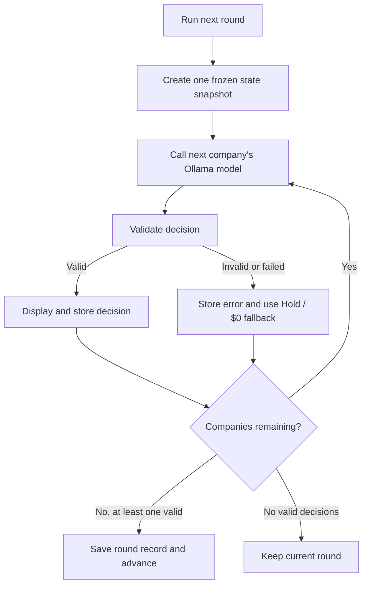
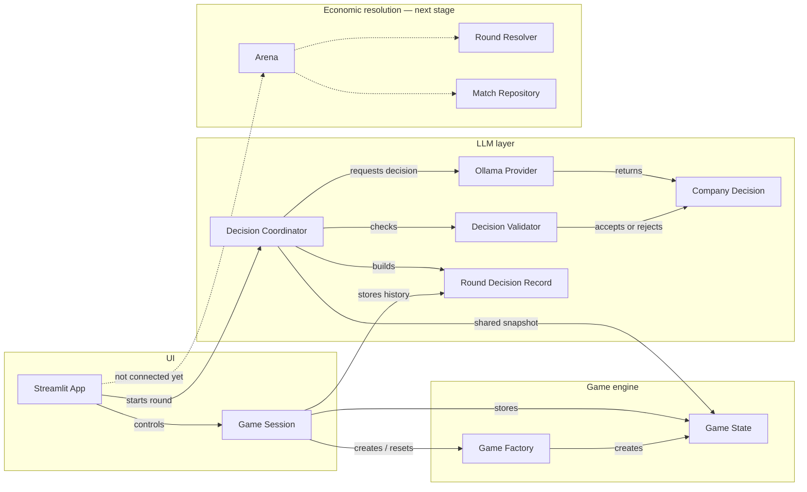
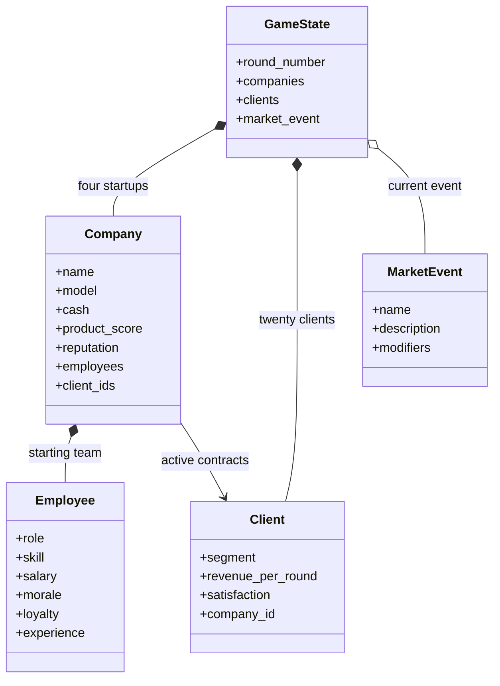

# LLM Startup Arena

Four local LLMs compete to build the most valuable startup over ten rounds.

The project is intentionally local-first and uses Ollama for model inference.

## Requirements

- [uv](https://docs.astral.sh/uv/)
- [Ollama](https://ollama.com/)
- The four local models:

```powershell
ollama pull qwen3:8b
ollama pull llama3.1:8b
ollama pull gemma3:12b
ollama pull mistral-nemo:12b
```

## Project structure

```text
llm_startup_arena/
|-- domain/         # Companies, employees, clients, events, and game state
|-- engine/         # Arena orchestration and deterministic round resolution
|-- llm/            # Provider contract, prompts, and Ollama integration
|-- persistence/    # JSON match storage
|-- ui/             # Streamlit interface
`-- config.py       # Global game configuration
```

The LLMs choose actions. The deterministic engine calculates all consequences.

## Employee roles

Employees are deterministic game entities, not additional LLM agents. Each employee has
a role, skill level, salary, morale, loyalty, and experience. These values will be used by
the game engine when it resolves company decisions.

| Role | Responsibility | Planned gameplay effect |
|---|---|---|
| `ENGINEER` | Builds and improves the technology | Makes product investment more effective |
| `PRODUCT` | Chooses what the company should build | Improves product direction and client satisfaction |
| `MARKETING` | Creates awareness and demand | Increases reputation and client attraction |
| `SALES` | Converts interested clients into contracts | Improves the chance of winning clients |
| `OPERATIONS` | Keeps the company efficient and organized | Reduces operating costs and supports employee morale |

The current starting team contains two engineers and one employee each in product,
marketing, and sales. Operations is available as a role but is not part of the initial
five-person team. Role bonuses are planned mechanics and are not implemented yet.

## Run locally

```powershell
uv sync
uv run streamlit run app.py
```

Open `http://localhost:8501` after Streamlit starts. `uv run` keeps the project
environment synchronized with `pyproject.toml` and `uv.lock`.

The main screen displays four company cards. `Run next round` calls the models one at a
time and displays each validated decision as soon as it arrives.

Run the checks with:

```powershell
uv run pytest
uv run ruff check .
```

## Round decision workflow

Each company receives the same frozen `GameState` snapshot. Models choose actions, while
the application validates and stores their responses without allowing them to calculate
or directly modify game outcomes.



Decision validation currently enforces:

- the total budget cannot exceed company cash;
- client and employee targets must exist and be unique;
- companies cannot recruit their own employees;
- sabotage actions and sabotage budgets must be consistent;
- one invalid model response does not stop the other companies.

The current stage collects decisions and advances the round counter. Economic effects such
as spending, payroll, product growth, recruitment, and client acquisition are implemented
in later stages of the deterministic engine.

## Architecture

### Application flow




### Game state


